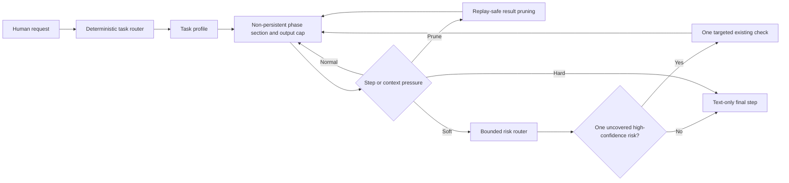

# DSH Adaptive Agent Policy

[中文](README.md) | English

An unofficial standalone DeepSeek Harness plugin that adapts prompts, output caps, soft and hard step budgets,
and tool-result pruning to each task class. It reduces unproductive loops on larger work while keeping the
user-selected model and tool presentation stable.

> Status: `0.1.0-rc.3` release candidate. DeepSeek Harness is still in developer preview. This
> plugin builds against its published `0.1.0-rc.6` package APIs; rerun the tests before each DSH upgrade.

## Attribution

| Project | Exact revision | Role | License |
|---|---|---|---|
| DeepSeek Harness | [`47f943859b`](https://github.com/deepseek-ai/deepseek-harness/tree/47f943859bef60e4160492346772ded9b24f765a) | Base architecture, Agent Loop, event log, and plugin APIs | MIT |
| OpenCode | [`e23586af26`](https://github.com/anomalyco/opencode/tree/e23586af2623f1bc2e8e6965d2d7acf7bd03d5c3) | Design reference for model prompts, last-step handling, output limits, and compaction | MIT |
| This plugin | This repository | DSH-native implementation of the adaptive policy | MIT |

OpenCode is a design reference, not a runtime dependency. The specific references are
[`session/system.ts`](https://github.com/anomalyco/opencode/blob/e23586af2623f1bc2e8e6965d2d7acf7bd03d5c3/packages/opencode/src/session/system.ts),
[`session/prompt.ts`](https://github.com/anomalyco/opencode/blob/e23586af2623f1bc2e8e6965d2d7acf7bd03d5c3/packages/opencode/src/session/prompt.ts),
[`tool/truncate.ts`](https://github.com/anomalyco/opencode/blob/e23586af2623f1bc2e8e6965d2d7acf7bd03d5c3/packages/opencode/src/tool/truncate.ts),
and
[`session/compaction.ts`](https://github.com/anomalyco/opencode/blob/e23586af2623f1bc2e8e6965d2d7acf7bd03d5c3/packages/opencode/src/session/compaction.ts).
See [NOTICE.md](NOTICE.md) for the complete provenance statement. This project is not endorsed by DeepSeek or
OpenCode.

## Added capabilities

- Model-free multilingual task routing: `read`, `small`, `frontend`, `large`, and `batch`.
- A second-layer router selects at most one high-confidence, uncovered risk at the soft checkpoint.
- Per-class maximum output tokens, soft checkpoints, and text-only hard final steps.
- A non-persistent system section carries policy state; its content is stable within a phase and is never appended to session history.
- `moderate`, `tight`, and `critical` pruning selected by step count or context pressure.
- Recent-result protection, aggregate minimum savings, and replay-safe replacement events.
- One public plugin entry; its enhanced pruner uses a private service name and does not collide with DSH's
  upstream static pruner.

The plugin never changes the user's provider, model, reasoning effort, permissions, sandbox, or Native/Code tool
presentation.

## Design



Core principles:

1. **Proportional control.** A read-only investigation should not pay the loop cost of a cross-module refactor.
2. **Keep cache prefixes stable where possible.** Never hot-switch the model or tool schema. The plugin's system section is
   byte-stable within a phase and changes only at the soft checkpoint, hard final step, or a new task.
3. **Add checks only at high confidence.** The router selects at most one uncovered risk; insufficient evidence
   creates no new verification work.
4. **Prune only when profitable.** History is untouched below the result-size and aggregate-saving thresholds.
5. **Never persist policy state.** Each request receives one compact system section during assembly. It creates no
   user/context history message, so policy input stays constant-sized instead of accumulating with every step.
6. **Everything remains a plugin.** Routing policy and pruning service retain separate Cordis lifecycles.

## Installation

```sh
dsh plugin --profile web add dsh-plugin-adaptive-agent-policy@next
```

The command adds the package to the `web` profile dependencies and
`dsh.profile.bundles`; no `settings.yaml` or manual `cordis.patch.yml` edit is
needed. Inspect the composition and start it with:

```sh
dsh --profile web --dump-config
dsh web
```

For source development or a custom Cordis root configuration, add it directly:

```yaml
- id: adaptive-agent-policy
  name: dsh-plugin-adaptive-agent-policy
  config: {}
```

The plugin installs its bundled enhanced pruner. It does not require a separate
`@deepseek-ai/dsh-compaction-tool-result-pruner` installation.

The second-layer router needs no configuration by default. To tune its conservative limits, override the plugin row
in the profile's `cordis.patch.yml`; this is composition, not `settings.yaml` configuration:

```yaml
- id: adaptive-agent-policy
  config:
    riskRouter:
      enabled: true
      minimumScore: 4
      maxRequestChars: 4096
      maxEvidenceChars: 8192
      skipCovered: true
```

## Defaults

### Task profiles

| Class | Maximum output tokens | Soft step | Text-only hard step |
|---|---:|---:|---:|
| `read` | 16,384 | 4 | 8 |
| `small` | 32,768 | 5 | 9 |
| `frontend` | 32,768 | 8 | 14 |
| `large` | 65,536 | 10 | 18 |
| `batch` | 65,536 | 10 | 20 |

The maximum applies only when the Agent has no explicit `maxTokens`; a stricter caller or provider cap wins.

### Progressive pruning

| Level | Step | Pressure | Result threshold | Retained head / tail | Protected recent steps | Minimum saving |
|---|---:|---:|---:|---:|---:|---:|
| `moderate` | 6 | 45% | 16,384 chars | 12,288 / 2,048 | 2 | 8,192 chars |
| `tight` | 10 | 65% | 8,192 chars | 4,096 / 1,024 | 1 | 4,096 chars |
| `critical` | 14 | 75% | 4,096 chars | 2,048 / 1,024 | 1 | 2,048 chars |

Either the step or pressure trigger qualifies a level. If model context-window metadata is unavailable, pressure
routing is disabled and step routing continues.

### Risk router

The closed families are `boundary`, `retry`, `concurrency`, `persistence`, `security`, `compatibility`, `frontend`,
`resource`, and `batch-integrity`. The router runs once on first reaching the soft checkpoint in a turn, inspects at
most 4,096 request characters and 8,192 recent tool-result characters, and makes no LLM call. Read-only tasks,
documentation-only changes, low-confidence matches, and risks explicitly covered by recent passing output are skipped.
A selected route asks for only one existing check or minimal reproduction.

## Benchmarks

The following controlled 2026-08-15 comparison covers the `rc.2` policy and used the same `deepseek-v4-pro` High route, credential source, prompts, seed
workspaces, visible tests, and isolated session homes. Hidden checks were absent from model workspaces. Each row is
one run, not an average.

| Task | Variant | Steps | Total tokens | Time | Cache hit | Quality |
|---|---|---:|---:|---:|---:|---|
| Small retry fix | Original | 6 | 59,891 | 44.2s | 84.1% | 5/5; hidden boundary passed |
| Small retry fix | Final adaptive | 6 | 66,830 | 49.5s | 85.2% | 5/5; hidden boundary passed |
| Frontend dashboard | Original | 9 | 174,022 | 180.4s | 93.2% | 5/5; 390 px overflow |
| Frontend dashboard | Final adaptive | 7 | 162,141 | 194.0s | 92.7% | 5/5; no 390 px overflow; persisted theme |
| Cross-module queue | Original | 8 | 207,525 | 355.5s | 93.4% | 7/7; hidden transitions 2/2 |
| Cross-module queue | Final adaptive | 6 | 158,420 | 255.0s | 91.4% | 7/7; hidden transitions 2/2 |

| Aggregate | Original | Final adaptive | Delta |
|---|---:|---:|---:|
| Total tokens | 441,438 | 387,391 | -12.2% |
| Wall time | 580.2s | 498.6s | -14.1% |

Large work used 23.7% fewer tokens and finished 28.3% faster at equal quality. Small work paid an 11.6% token
premium to retain the interaction boundary. Frontend used 6.8% fewer tokens but took 7.5% longer while fixing
mobile overflow. Normal benchmark sessions emitted no prune replacements because no stale large result qualified;
unit and integration tests exercise all three pruning levels separately.

An early broad-prompt iteration induced the frontend agent to build a CDP verifier, expanding the run to 30
steps, 1.316M tokens, and 675.7 seconds. The `rc.2` policy therefore uses deterministic classes, one executable
class-specific check, bounded frontend verification, and a text-only last step instead of generic prompt stacking.

A third-party single run reported an important counterexample: roughly 720K input tokens for the original,
1.17M for PTC mode, and 1.05M for standard mode. Output fell from roughly 450K to 250K/140K, but the standard
mode's total was approximately unchanged and PTC was about 22% higher. No reproducible raw logs accompanied the
report, so it is treated as an external observation rather than merged into the table. It exposed the `rc.2`
session-history accumulation problem and directly motivated the non-persistent phase section in `rc.3`. Real-model
token savings for `rc.3` still require a repeated run on the same task.

The carrier has an explicit cache tradeoff: the plugin section's bytes are identical within a phase, while entering the
soft checkpoint or hard final step changes the system header once and may miss the old cached prefix for that
request. The plugin accepts at most two phase transitions per turn to avoid persistent per-step policy messages.

These are single samples from a nondeterministic model and support a direction, not a universal or statistically
significant performance claim.

## Development and publication

```sh
pnpm install
pnpm run check
npm login
npm publish --tag next
```

## Known limits

- Text routing can conservatively misclassify ambiguous tasks; it deliberately avoids a routing model call.
- The risk router is a heuristic evidence selector, not a complete static analysis or security audit; it deliberately
  stays inactive at low confidence.
- Policy notices written by `rc.2` and older remain in those existing session histories; `rc.3` creates no new
  policy history messages.
- A phase transition changes the system header and may miss that request's old cache prefix; the header stays stable
  within a phase.
- Character pruning is not token-exact and does not understand the semantic importance of removed content.
- A text-only hard step bounds runaway loops but can stop work that genuinely needs more tool steps; tune profiles
  from repeated workload evidence.
- DSH is evolving quickly; this release currently treats `0.1.0-rc.6` as its compatibility boundary.

## License

[MIT](LICENSE). Redistributions should retain the provenance statement in [NOTICE.md](NOTICE.md).
