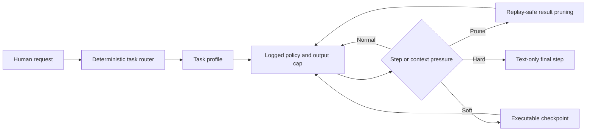

# DSH Adaptive Agent Policy

中文 | [English](README.en.md)

一个可独立发布的非官方 DeepSeek Harness 插件：根据任务类别动态控制提示词、输出上限、软硬步骤预算与
工具结果裁剪，在保持用户所选模型和工具展示方式稳定的前提下，减少大型任务中的无效循环。

> 状态：`0.1.0-rc.2` 发布候选。DeepSeek Harness 仍处于开发者预览阶段，插件以公开的
> `0.1.0-rc.6` 包 API 构建；升级 DSH 时应先重新运行测试。

## 出处与声明

| 项目 | 精确版本 | 用途 | 许可证 |
|---|---|---|---|
| DeepSeek Harness | [`47f943859b`](https://github.com/deepseek-ai/deepseek-harness/tree/47f943859bef60e4160492346772ded9b24f765a) | 基础架构、Agent Loop、事件日志与插件接口 | MIT |
| OpenCode | [`e23586af26`](https://github.com/anomalyco/opencode/tree/e23586af2623f1bc2e8e6965d2d7acf7bd03d5c3) | 模型提示词、最后一步、工具输出限界与压缩策略参考 | MIT |
| 本插件 | 本仓库 | 按 DSH 事件与插件约定重新实现的自适应策略 | MIT |

OpenCode 是设计参考，不是运行时依赖。具体参考文件包括
[`session/system.ts`](https://github.com/anomalyco/opencode/blob/e23586af2623f1bc2e8e6965d2d7acf7bd03d5c3/packages/opencode/src/session/system.ts)、
[`session/prompt.ts`](https://github.com/anomalyco/opencode/blob/e23586af2623f1bc2e8e6965d2d7acf7bd03d5c3/packages/opencode/src/session/prompt.ts)、
[`tool/truncate.ts`](https://github.com/anomalyco/opencode/blob/e23586af2623f1bc2e8e6965d2d7acf7bd03d5c3/packages/opencode/src/tool/truncate.ts)
与
[`session/compaction.ts`](https://github.com/anomalyco/opencode/blob/e23586af2623f1bc2e8e6965d2d7acf7bd03d5c3/packages/opencode/src/session/compaction.ts)。
完整来源声明见 [NOTICE.md](NOTICE.md)。本项目不代表 DeepSeek 或 OpenCode 官方立场，也不宣称获得上游背书。

## 增加的能力

- 无模型调用的多语言任务路由：`read`、`small`、`frontend`、`large`、`batch`；
- 每个任务类别独立的最大输出 token、软检查步骤与纯文本硬终步；
- 小型、大型和前端任务各自专属的可执行验证提示词，避免笼统“仔细检查”；
- 根据步骤数或上下文压力选择 `moderate`、`tight`、`critical` 裁剪等级；
- 保护近期工具结果、设置最小总节省量、保留可安全回放的事件；
- 对外仅一个插件配置项，包内增强裁剪器使用独立服务名，不与 DSH 上游静态裁剪器冲突。

插件不会更改用户选择的提供方、模型、推理强度、权限、沙箱或 Native/Code 工具展示方式。

## 设计思路



核心原则：

1. **按任务比例施加控制。** 只读分析不应承担跨模块重构的循环成本。
2. **保持主路由与缓存前缀稳定。** 不在已有工具历史后热切换模型或工具 schema。
3. **用可执行证据替代口头复查。** 检查点只要求一次高价值交互验证，不重新开启大范围探索。
4. **只在有收益时裁剪。** 未达到大小和总节省阈值时完全不改写历史。
5. **模型可见即日志可见。** 任务策略、检查点和终步通知都进入 DSH 事件日志。
6. **一切仍是插件。** 路由策略与裁剪服务边界独立，可通过普通 Cordis 生命周期替换。

## 安装

```sh
dsh plugin --profile web add dsh-plugin-adaptive-agent-policy@next
```

安装命令会把包加入 `web` Profile 的依赖和 `dsh.profile.bundles`，无需修改
`settings.yaml` 或手动编辑 `cordis.patch.yml`。检查组合结果后启动：

```sh
dsh --profile web --dump-config
dsh web
```

从源码开发或使用自定义 Cordis 根配置时，也可以直接加入：

```yaml
- id: adaptive-agent-policy
  name: dsh-plugin-adaptive-agent-policy
  config: {}
```

插件会自动安装包内的增强裁剪服务。无需另外安装或配置 DSH 上游的
`@deepseek-ai/dsh-compaction-tool-result-pruner`。

## 默认参数

### 任务配置

| 类别 | 最大输出 token | 软检查步骤 | 纯文本硬终步 |
|---|---:|---:|---:|
| `read` | 16,384 | 4 | 8 |
| `small` | 32,768 | 5 | 9 |
| `frontend` | 32,768 | 8 | 14 |
| `large` | 65,536 | 10 | 18 |
| `batch` | 65,536 | 10 | 20 |

最大输出仅在 Agent 没有明确 `maxTokens` 时生效；更严格的调用方或提供方上限始终优先。

### 渐进式裁剪

| 等级 | 步骤 | 压力 | 结果阈值 | 保留头／尾 | 保护近期步骤 | 最小节省量 |
|---|---:|---:|---:|---:|---:|---:|
| `moderate` | 6 | 45% | 16,384 chars | 12,288 / 2,048 | 2 | 8,192 chars |
| `tight` | 10 | 65% | 8,192 chars | 4,096 / 1,024 | 1 | 4,096 chars |
| `critical` | 14 | 75% | 4,096 chars | 2,048 / 1,024 | 1 | 2,048 chars |

步骤或压力条件任一满足即可进入该等级。没有模型上下文窗口元数据时，压力路由关闭，步骤路由继续。

## 基准测试

2026-08-15 的受控对比使用相同 `deepseek-v4-pro` High 路由、凭据来源、提示词、种子工作区、可见测试与
隔离会话目录。隐藏检查不在模型工作区内。每行仅运行一次，不是统计平均值。

| 任务 | 版本 | 步骤 | 总 token | 用时 | 缓存命中 | 质量结果 |
|---|---|---:|---:|---:|---:|---|
| 小型重试修复 | 原版 | 6 | 59,891 | 44.2s | 84.1% | 5/5；隐藏边界通过 |
| 小型重试修复 | 最终自适应版 | 6 | 66,830 | 49.5s | 85.2% | 5/5；隐藏边界通过 |
| 前端仪表盘 | 原版 | 9 | 174,022 | 180.4s | 93.2% | 5/5；390 px 溢出 |
| 前端仪表盘 | 最终自适应版 | 7 | 162,141 | 194.0s | 92.7% | 5/5；390 px 无溢出，主题持久化 |
| 跨模块队列 | 原版 | 8 | 207,525 | 355.5s | 93.4% | 7/7；隐藏转换 2/2 |
| 跨模块队列 | 最终自适应版 | 6 | 158,420 | 255.0s | 91.4% | 7/7；隐藏转换 2/2 |

| 汇总 | 原版 | 最终自适应版 | 差异 |
|---|---:|---:|---:|
| 总 token | 441,438 | 387,391 | -12.2% |
| 总耗时 | 580.2s | 498.6s | -14.1% |

大型任务 token 减少 23.7%、用时减少 28.3%，质量持平；小型任务为保留交互边界多用了 11.6% token；
前端少用 6.8% token，但为修复移动端溢出多耗时 7.5%。正常基准中裁剪替换次数为零，因为没有符合条件的
陈旧大型工具结果；裁剪的三个等级由单元与集成测试单独覆盖。

早期宽泛提示词版本曾把前端任务诱导到自建 CDP 验证器，膨胀到 30 步、1.316M token、675.7 秒。最终版
因此使用确定性分类、一次类别专属检查、有界前端验证和纯文本终步，而不继续堆叠通用提示词。

这些都是非确定性模型的单次样本，只能支持优化方向，不能证明普遍或统计显著的性能优势。

## 开发与独立发布

```sh
pnpm install
pnpm run check
npm login
npm publish --tag next
```

## 已知边界

- 文本路由可能保守地误判含糊任务；它有意不增加路由模型调用。
- 字符裁剪不等于精确 token 裁剪，也不会理解被裁剪内容的语义重要性。
- 纯文本硬终步能限制失控循环，也可能截断确实需要更多工具步骤的任务，应依据重复测试调参。
- DSH 仍在快速迭代；该插件目前把 `0.1.0-rc.6` 作为兼容边界。

## 许可证

[MIT](LICENSE)。再分发时请同时保留 [NOTICE.md](NOTICE.md) 中的出处声明。
